# Class Hierarchy

This diagram shows the inheritance relationships between classes.

```mermaid
graph TD
    cli_MDVisError[MDVisError]:::exception
    manager_ConfigurationError[ConfigurationError]:::exception
    manager_ConfigManager[ConfigManager]
    schema_EventPatternConfig[EventPatternConfig]
    schema_EventConfig[EventConfig]
    schema_OutputConfig[OutputConfig]
    schema_AnalysisConfig[AnalysisConfig]
    schema_VisualizationConfig[VisualizationConfig]
    schema_LintingConfig[LintingConfig]
    schema_ProjectConfig[ProjectConfig]
    schema_MDVisConfig[MDVisConfig]
    indexer_IndexBuilder[IndexBuilder]
    parser_EnhancedASTParser[EnhancedASTParser]
    processor_ProcessingStats[ProcessingStats]
    processor_DocumentationProcessor[DocumentationProcessor]
    scanner_FileScanner[FileScanner]
    scanner_SourceFileInfo[SourceFileInfo]
    elements_VisibilityLevel[VisibilityLevel]
    elements_AsyncPatternType[AsyncPatternType]
    elements_Location[Location]
    elements_TypeRef[TypeRef]
    elements_Parameter[Parameter]
    elements_EventUsage[EventUsage]
    elements_AsyncPattern[AsyncPattern]
    elements_CallRef[CallRef]
    elements_ImportStatement[ImportStatement]
    elements_Decorator[Decorator]
    elements_Function[Function]
    elements_Attribute[Attribute]
    elements_Class[Class]
    elements_Module[Module]
    index_ReferenceType[ReferenceType]
    index_ElementRef[ElementRef]
    index_ImportResolution[ImportResolution]
    index_TypeResolution[TypeResolution]
    index_CallResolution[CallResolution]
    index_EventFlow[EventFlow]
    index_DependencyEdge[DependencyEdge]
    index_CrossReferenceIndex[CrossReferenceIndex]
    obsidian_ObsidianGenerator[ObsidianGenerator]
    templates_TemplateManager[TemplateManager]
    templates_TemplateLoader[TemplateLoader]
    visualizations_MermaidGenerator[MermaidGenerator]
    async_helpers_AsyncProgress[AsyncProgress]
    Exception[Exception]:::external
    Exception --> cli_MDVisError
    Exception[Exception]:::external
    Exception --> manager_ConfigurationError
    BaseModel[BaseModel]:::external
    BaseModel --> schema_EventPatternConfig
    BaseModel[BaseModel]:::external
    BaseModel --> schema_EventConfig
    BaseModel[BaseModel]:::external
    BaseModel --> schema_OutputConfig
    BaseModel[BaseModel]:::external
    BaseModel --> schema_AnalysisConfig
    BaseModel[BaseModel]:::external
    BaseModel --> schema_VisualizationConfig
    BaseModel[BaseModel]:::external
    BaseModel --> schema_LintingConfig
    BaseModel[BaseModel]:::external
    BaseModel --> schema_ProjectConfig
    BaseModel[BaseModel]:::external
    BaseModel --> schema_MDVisConfig
    Enum[Enum]:::external
    Enum --> elements_VisibilityLevel
    Enum[Enum]:::external
    Enum --> elements_AsyncPatternType
    Enum[Enum]:::external
    Enum --> index_ReferenceType
    BaseLoader[BaseLoader]:::external
    BaseLoader --> templates_TemplateLoader
    classDef abstract fill:#ffebee,stroke:#d32f2f
    classDef dataclass fill:#e8f5e8,stroke:#4caf50
    classDef exception fill:#fff3e0,stroke:#ff9800
    classDef external fill:#f5f5f5,stroke:#9e9e9e,stroke-dasharray: 5 5
```

## Legend

- **Green boxes** → Data classes
- **Red boxes** → Abstract classes
- **Orange boxes** → Exception classes
- **Gray dashed boxes** → External classes

Generated on: 2025-06-30 20:58:04
