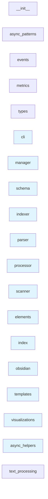

# Module Dependencies

This diagram shows the dependencies between modules in the codebase.

## Legend

- **Solid arrows** → Import dependencies
- **Dotted arrows** → Inheritance relationships  
- **Bold arrows** → Function call dependencies

Generated on: 2025-06-30 20:58:04
