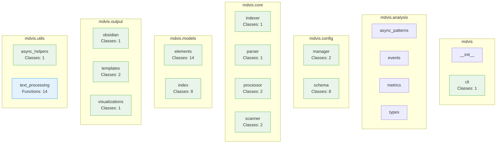

# Codebase Overview

High-level overview of the codebase structure and organization.

## Statistics

- **Total modules:** 25
- **Total classes:** 44
- **Total functions:** 201
- **Total lines:** 6,623

Generated on: 2025-06-30 20:58:04
